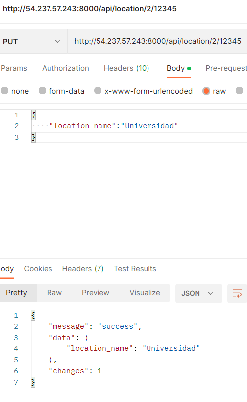
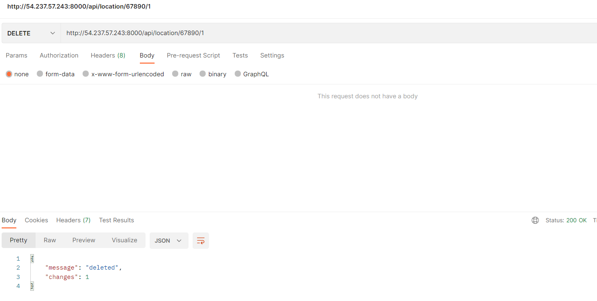
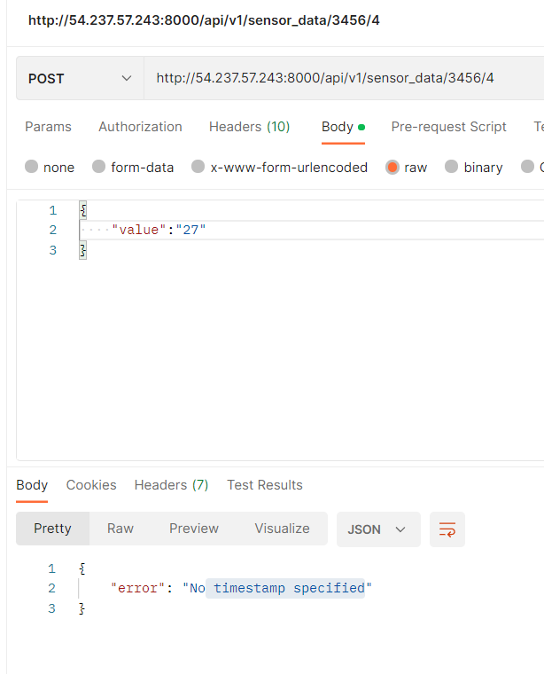
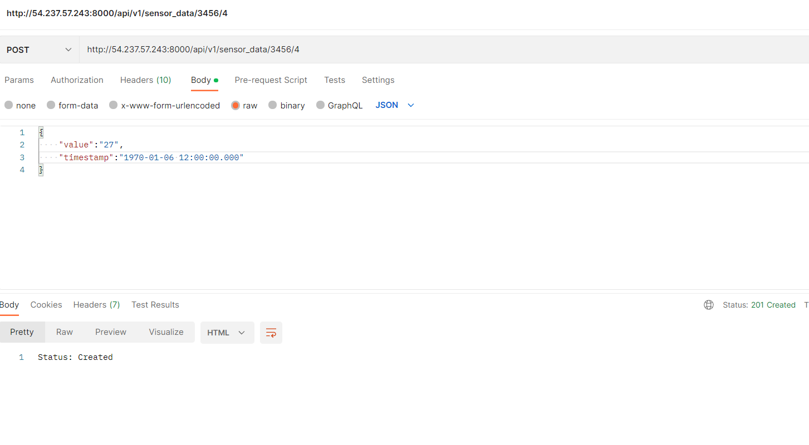
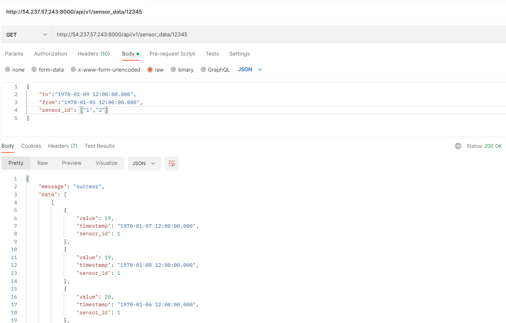

# T3_arquiemergentes

## Integrantes:
- Christian Bastias 
- Joaquín Neira

## 

API desplegada en AWS (EC2)
- Dirección de la API: 54.237.57.243
- Puerto:8000

Enlace a API: [Click Aquí](http://54.237.57.243:8000/api/location/12345/1)

Al momento de implementar la instancia EC2 de AWS, presentó intermitencia impidiendo que el servicio se mantuviera arriba por periodos largos de tiempo. En caso de que el lector no pueda acceder a esta, se adjuntan imágenes que describen el funcionamineto de la API en la instancia (se usa **company_api_key** igual a 12345):

### GET Location

### GET Location por location_id

### GET Sensor

### GET Sensor por sensor_id

### PUT Location

### PUT Location por location_id

### DELETE Location

### POST Sensor_data (No se inserta timestamp, por ende, no se realiza la inserción)

### POST Sensor_data (*201 CREATED*)

### GET Sensor_data 

